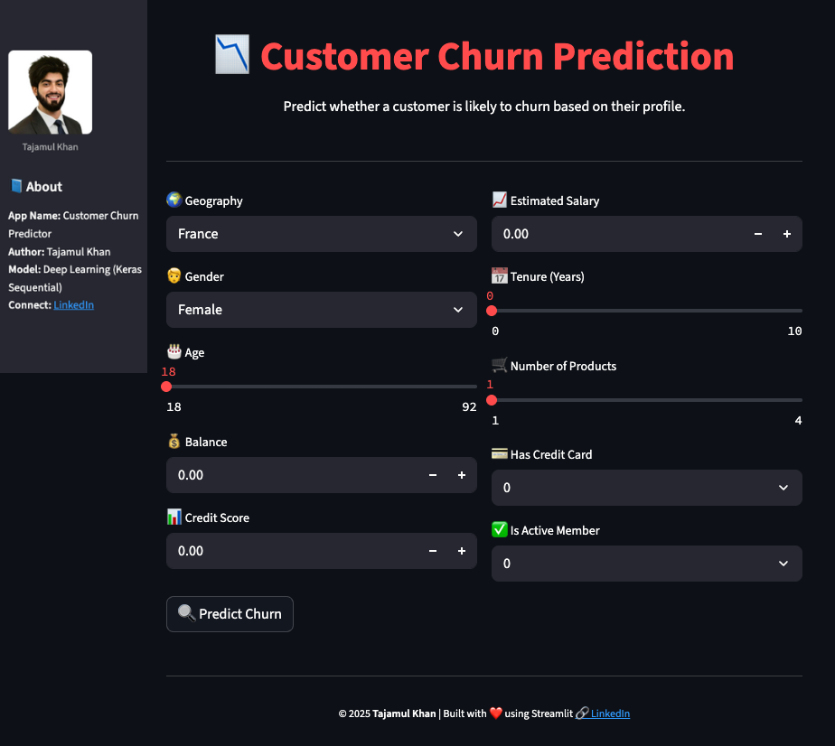

# 🔁 Customer Churn Prediction Using ANN

A deep-learning project focused on predicting customer churn using an artificial neural network (ANN), leveraging customer behaviour data and financial/demographic features.


---

## 📌 Project Overview

This project builds a complete pipeline: collecting customer attributes, preprocessing and feature engineering, designing and training a neural network model, evaluation, and actionable insights. The objective is to predict which customers are likely to leave (churn) and support retention strategies.

---

## 🧰 Tech Stack

* **Language:** Python
* **Libraries:** pandas, numpy, matplotlib, seaborn, TensorFlow/Keras or PyTorch
* **Environment:** Jupyter Notebook / Google Colab

---

## 🔄 Workflow Summary

### 1. Data Collection

Dataset includes customer details such as age, tenure, account balance, products held, credit history, geographical region, and a target variable indicating churn status.

### 2. Exploratory Data Analysis (EDA)

* Distribution of churn vs non-churn customers
* Visualisations of key features (income, tenure, products held) by churn status
* Heatmap of feature correlations; identification of missing values and outliers
* Observation of class imbalance and distribution skew

### 3. Feature Engineering

* Encoding categorical variables (e.g., geography, gender)
* Deriving features such as income-to-balance ratio, number of products, active membership indicator
* Scaling numerical variables (standardization/normalization)
* Splitting data into training and test sets (and optionally validation)

### 4. Neural Network Modeling

* Built an ANN with input layer aligned to number of features
* Hidden layers with activation functions such as ReLU, followed by dropout regularization to reduce over-fitting
* Output layer with sigmoid activation for binary churn prediction
* Compilation with optimizer (e.g., Adam), loss function (`binary_crossentropy`), and metric (`accuracy`)

  ```python
  model.compile(optimizer='Adam',
                loss='binary_crossentropy',
                metrics=['accuracy'])
  ```
* Model training over epochs, with batch size and validation split defined
* Example architecture:

  * Dense layer: input_dim = number_of_features, activation = ‘relu’
  * Dense layer: size similar or smaller, activation = ‘relu’
  * Dropout layer
  * Dense(1, activation = ‘sigmoid’)

### 5. Evaluation

Model performance measured with:

* Accuracy
* Precision, Recall, F1-Score
* Confusion Matrix
* ROC-AUC
* Review of loss & accuracy curves (training vs validation)
  **Result:** The ANN achieved strong predictive performance, showing effectiveness in distinguishing churners vs retained customers.

### 6. Prediction & Insights

* Generated churn-probability predictions on unseen customer data
* Identified top predictors influencing churn risk (e.g., tenure, credit history, number of products)
* Recommended business action: early intervention for high-risk customers, tailored retention offers, product bundling to reduce churn

---

## 📁 Project Structure

```
Customer-Churn-Prediction-Using-ANN/
│── data/
│── notebooks/
│── src/
│── README.md
│── requirements.txt
```

---

## 📈 Key Findings

* Customers with shorter tenure and fewer products tend to have higher churn risk
* Features like credit history and active membership status significantly improved prediction accuracy
* Scaling and encoding of features improved model stability and convergence
* The ANN model can be integrated by business teams for proactive customer retention strategies

---

## 🚀 Future Improvements

* Incorporate time-series usage data (monthly/user activity logs) to capture behaviour change over time
* Use more advanced architectures such as deep neural networks or recurrent models for sequential behaviour
* Deploy as a web app/interface for business teams to input customer data and get churn-risk scores
* Monitor model fairness across demographic groups and mitigate bias
* Implement automatic retraining and real-time scoring pipeline for production usage

---

## 🧑‍💻 Author

**[Tajamul Khan](https://www.linkedin.com/in/tajamulkhann/) – Data Scientist & AI Engineer**

## Let's Connect 

<div align="center">

<a href="https://www.linkedin.com/in/tajamulkhann/">

</a>
<a href="https://www.instagram.com/tajamul.datascientist/" target="_blank">

</a>
<a href="https://topmate.io/tajamulkhan" target="_blank">

</a>
<a href="https://www.whatsapp.com/channel/0029VaYs05jJkK7JKCesw42f">

</a>
<a href="https://t.me/tajamul_khan">

</a>
<a href="https://substack.com/@tajamulkhan">

</a>
<a href="https://www.kaggle.com/tajamulkhan">

</a>
<a href="https://github.com/tajamulkhann">

</a>
<a href="https://medium.com/@tajamulkhan">

</a>
<a href="https://www.youtube.com">

</a>
</div>
